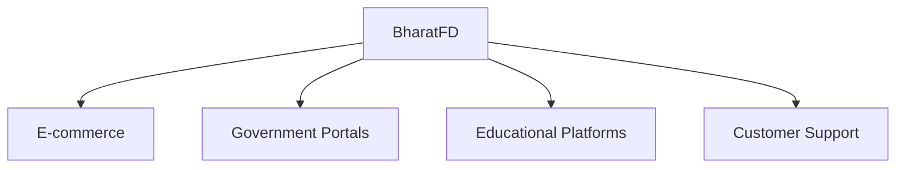
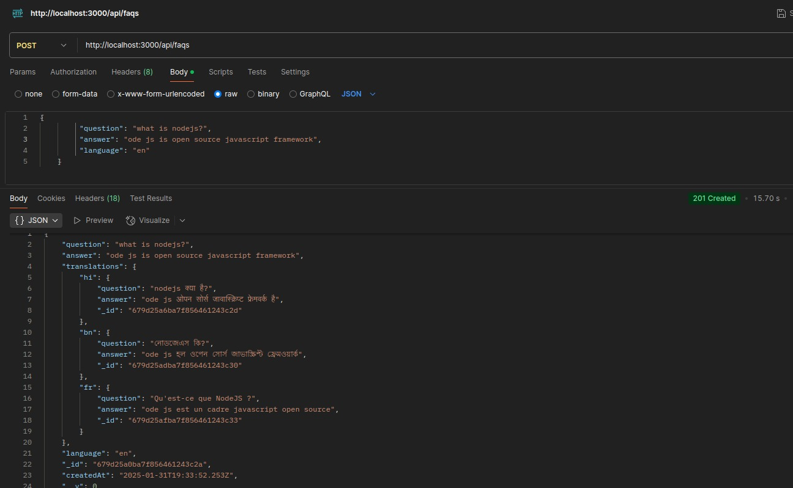
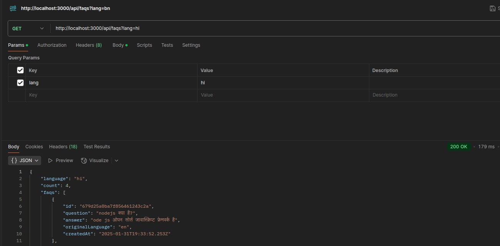

<div align="center">
  <h1>🌏 BharatFD</h1>
  <p><i>Intelligent Multilingual FAQ Management System</i></p>
  
  [](https://nodejs.org/)
  [](https://www.mongodb.com/)
  [](https://redis.io/)
  [](LICENSE)
</div>

## Overview

BharatFD is an advanced FAQ management system designed to break language barriers. Powered by Google's Gemini Pro AI, it provides seamless translation and management of FAQs across multiple languages, making information accessible to diverse audiences.

## Features

### 🔄 Real-time Translation
- Automatic translation using Google Gemini Pro
- Support for English, Hindi, Bengali, and French
- Intelligent caching of translations

### 💾 Smart Storage
- MongoDB-based document storage
- Redis caching layer
- Efficient version control

### 🛡️ Enterprise Ready
- Rate limiting
- Request validation
- Security middleware integration

## Use Cases



## Images


### FAQs in Hindi


### FAQs in Bangla


## Getting Started

### Prerequisites

- Node.js 18+
- MongoDB 4.4+
- Redis 6.0+

### Docker Installation

```sh
# Clone repository
git clone https://github.com/yourusername/bharatfd.git

# Navigate to project
cd bharatfd

# Launch with Docker
docker-compose up
```

### Manual Installation

1. Install dependencies:
```sh
npm install
```

2. Configure environment:
```sh
cp .env.example .env
```

3. Set up environment variables:
```env
PORT=3000
MONGODB_URI=mongodb://localhost:27017/faqdb
REDIS_HOST=localhost
REDIS_PORT=6379
GEMINI_API_KEY=your_api_key
```

4. Start the server:
```sh
npm run dev
```

## API Reference

### Create FAQ

```http
POST /api/faqs
Content-Type: application/json

{
  "question": "What is BharatFD?",
  "answer": "A multilingual FAQ management system",
  "language": "en"
}
```

### Retrieve FAQs

```http
GET /api/faqs?lang=hi
```

## Configuration

### Translation Settings

```javascript
{
  "supportedLanguages": ["en", "hi", "bn", "fr"],
  "defaultLanguage": "en",
  "cacheTimeout": 3600
}
```

### Cache Strategy

```javascript
{
  "strategy": "multi-level",
  "ttl": 3600,
  "maxSize": "1GB"
}
```

## Project Structure

```
bharatfd/
├── src/
│   ├── config/      # Configuration files
│   ├── controllers/ # Request handlers
│   ├── middlewares/ # Custom middlewares
│   ├── models/      # Data models
│   ├── routes/      # API routes
│   ├── services/    # Business logic
│   └── utils/       # Helper functions
├── tests/           # Test suites
└── docker/          # Docker configurations
```

## Development

### Running Tests

```sh
# Run all tests
npm test

# Run specific suite
npm test -- --grep "API Tests"

# Generate coverage
npm run test:coverage
```


## License

This project is licensed under the MIT License - see the [LICENSE](LICENSE) file for details.

## Acknowledgments

* Google Gemini AI Team
* MongoDB Community
* Redis Labs
* Express.js Community
